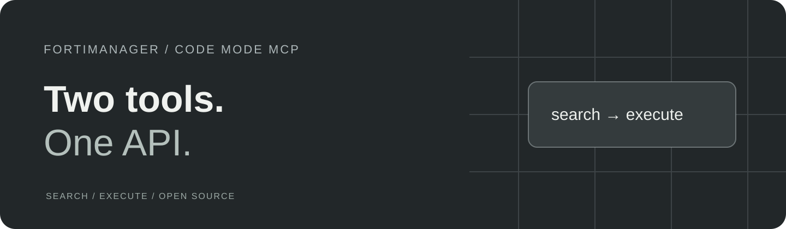

<p align="center">
  
</p>

<p align="center">
  <strong>Manage FortiManager through two MCP tools.</strong><br>
  Search the JSON-RPC reference, then run sandboxed JavaScript against your FortiManager.
</p>

<p align="center">
  <a href="#get-started">Get started</a> ·
  <a href="#example-session">Example session</a> ·
  <a href="#know-the-boundaries">Boundaries</a> ·
  <a href="CONTRIBUTING.md">Contribute</a>
</p>

<p align="center">Node.js 22.19+ · Stable · v1.1.0 · MIT license</p>

[](https://github.com/jmpijll/fortimanager-code-mode-mcp/actions/workflows/ci.yml)

## Two tools, one API

This [Model Context Protocol](https://modelcontextprotocol.io/) server exposes `search` and `execute`.
The agent searches the API reference, then runs JavaScript inside a QuickJS WASM sandbox.
API calls go through the host; credentials remain outside the sandbox.

- **Search the reference.** Find objects, attributes, URLs, methods and error codes.
- **Call JSON-RPC.** Use `fortimanager.request()` with FortiManager 7.4 or 7.6.
- **Choose a transport.** Stdio for local clients; Streamable HTTP for hosted use.
- **Keep credentials on the host.** Optional HTTP Bearer auth and per-request `X-FMG-Token` passthrough.

## Get started

Install from source and point your MCP client at the built `dist/index.js`.

### Requirements

- Node.js **22.19.0 or newer** and npm. CI checks Node 22 and 24.
- FortiManager 7.4 or 7.6, an API token, and locally generated API specs.

Before building, download the Fortinet HTML reference and run `npm run generate:spec`.
See [API spec setup](docs/usage-guide.md#important-api-spec-required). The proprietary
HTML and generated specs are not redistributed.

### Build from source

```bash
git clone https://github.com/jmpijll/fortimanager-code-mode-mcp.git
cd fortimanager-code-mode-mcp
npm ci
cp .env.example .env
# Edit .env: FMG_HOST and FMG_API_TOKEN.
npm run generate:spec
npm run build
npm start
```

The shell examples use Bash. In PowerShell, use `Copy-Item .env.example .env` and
set variables with `$env:NAME = 'value'`.

Configure your MCP client with `node /absolute/path/to/fortimanager-code-mode-mcp/dist/index.js`.
Use an absolute path and supply credentials through the client's environment configuration
when its working directory does not contain your `.env` file.
See the [client setup and usage guide](docs/usage-guide.md).

For hosted use, set `MCP_TRANSPORT=http`. See the [configuration and auth contract](docs/usage-guide.md#configuration).
Docker instructions are in [docker-compose.yml](docker-compose.yml).

## Important: API Spec Required

[Generate the Fortinet API specs locally](docs/usage-guide.md#important-api-spec-required) before starting the server.

## Example session

After discovering the operation with the search tool, use the execute tool:

```javascript
var response = fortimanager.request('get', [{ url: '/sys/status' }]);
response.result[0].data;
```

See the [usage guide](docs/usage-guide.md) for search recipes, configuration and additional call shapes.

## Know the boundaries

| Area | Current boundary |
| --- | --- |
| API reference | Generated locally from licensed Fortinet documentation; required at startup. |
| Permissions | Upstream FortiManager permissions govern API calls. Token passthrough falls back to the environment token when the header is absent. |
| Deployment | Node and Docker; no Cloudflare Worker entry. |
| Sandbox | Resource limits bound each invocation; allowed API calls still act with the supplied account's permissions. |

### Verification status

Local mocked tests cover the client, sandbox, tool responses and HTTP transport. The earlier live FortiManager record is separate from the current offline suite.
See the [setup and verification reference](docs/usage-guide.md#setup-and-verification-reference)
for the detailed historical evidence and remaining work. New verification reports should
identify the server revision, client, upstream version and operations actually exercised.

### Project status

Stable · v1.1.0. Generate the required API spec before starting either transport.

## Privacy

The host sends API requests to the service configured for this server. Tool results and
captured sandbox logs are returned to your MCP client; that client may send them to its
configured model provider. Spec caches may be written locally.

Keep `.env` files and credentials private. Redact account identifiers, IP addresses and
service data before sharing logs or verification reports. See [SECURITY.md](SECURITY.md)
for vulnerability reporting.

## Development and contribution

```bash
npm run check
```

`check` runs lint, formatting, typecheck, mocked tests and the build. See [CONTRIBUTING.md](CONTRIBUTING.md)
for the repository layout and contribution checks, and [AGENTS.md](AGENTS.md) for
architectural invariants. Live API tests require separate credentials and verification scope.

## Documentation

- [Usage and client setup](docs/usage-guide.md)
- [Architecture](docs/architecture.md)
- [Changelog](CHANGELOG.md)

## License and acknowledgements

[MIT](LICENSE). Built with TypeScript, the MCP SDK and QuickJS, following the
[Cloudflare Code Mode pattern](https://github.com/cloudflare/mcp-server-cloudflare).
